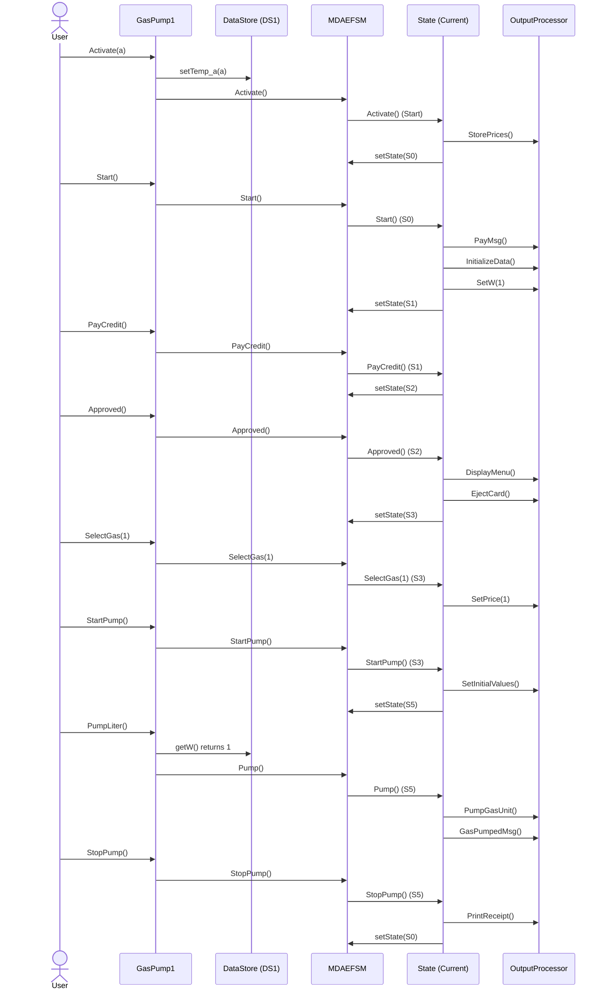
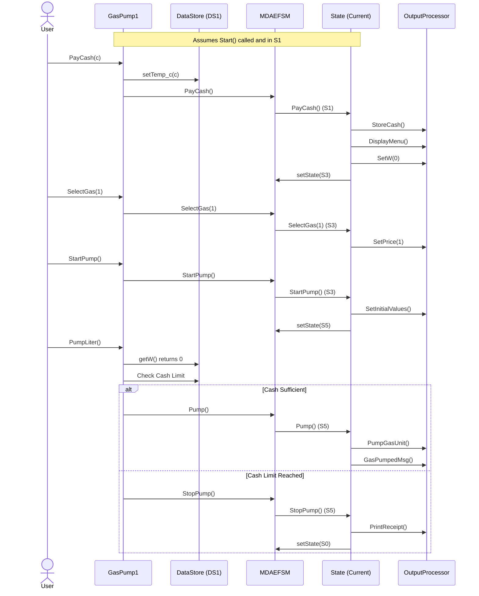
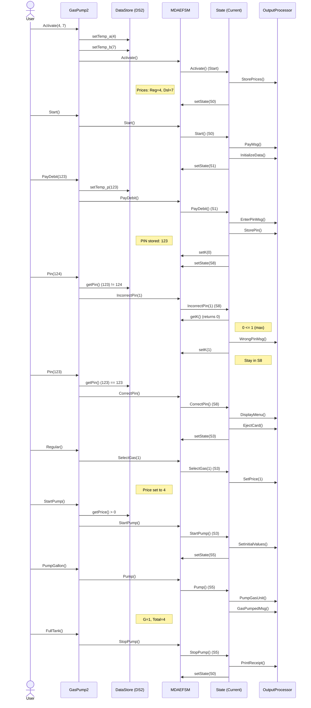
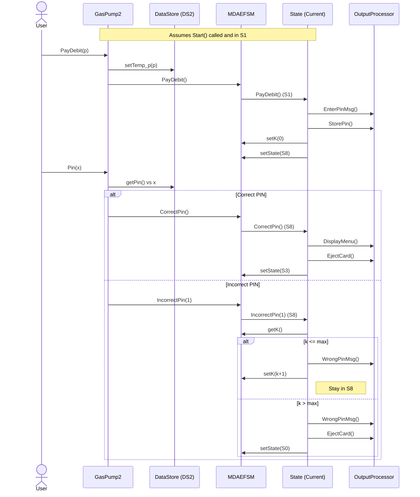
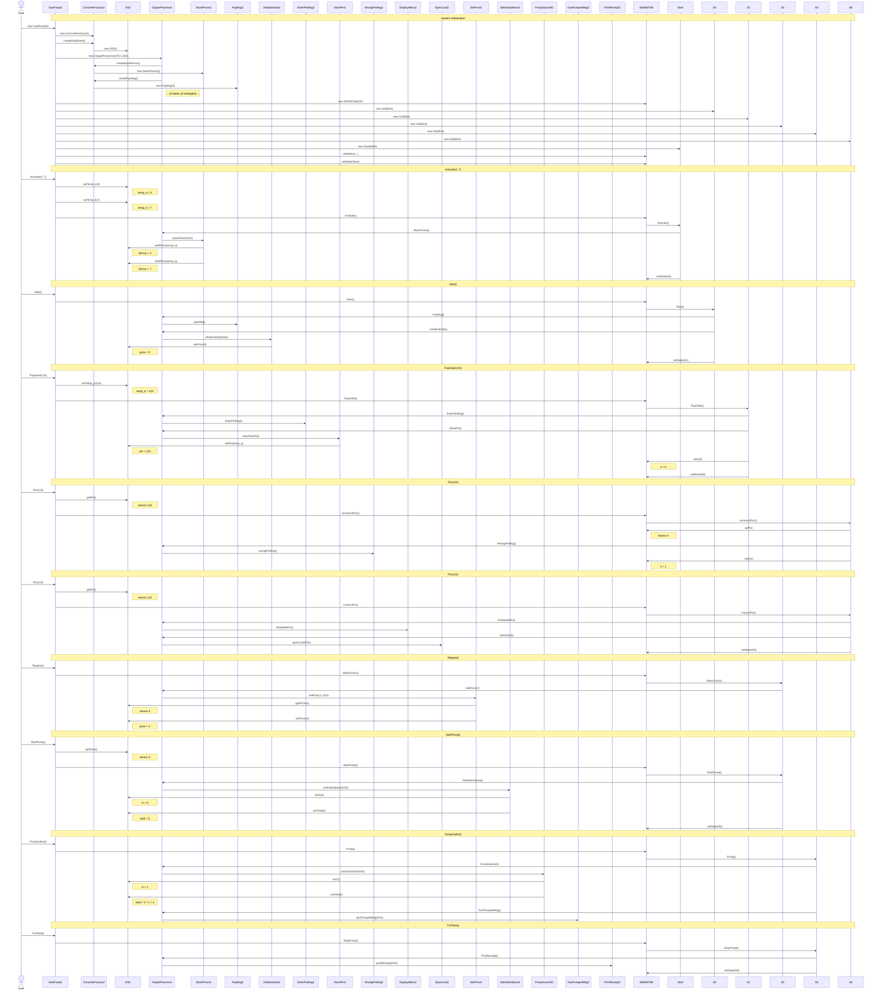

# Gas Pump Sequence Diagrams

You can copy the code blocks below and paste them into [Mermaid Live Editor](https://mermaid.live/) or [draw.io](https://app.diagrams.net/) (Insert -> Advanced -> Mermaid) to generate the diagrams.

## GasPump1 - Credit Flow (Success)

## GasPump1 - Cash Flow (Prepaid Limit)

## GasPump2 - Specific Scenario (PIN Retry & Full Tank)
**Sequence:** `Activate(4, 7)`, `Start()`, `PayDebit(123)`, `Pin(124)`, `Pin(123)`, `Regular()`, `StartPump()`, `PumpGallon()`, `FullTank()`

## GasPump2 - Debit Flow (PIN Verification)

## GasPump2 - Detailed Implementation Flow (All Classes)
**Scenario:** `Activate(4, 7)`, `Start()`, `PayDebit(123)`, `Pin(124)`, `Pin(123)`, `Regular()`, `StartPump()`, `PumpGallon()`, `FullTank()`

